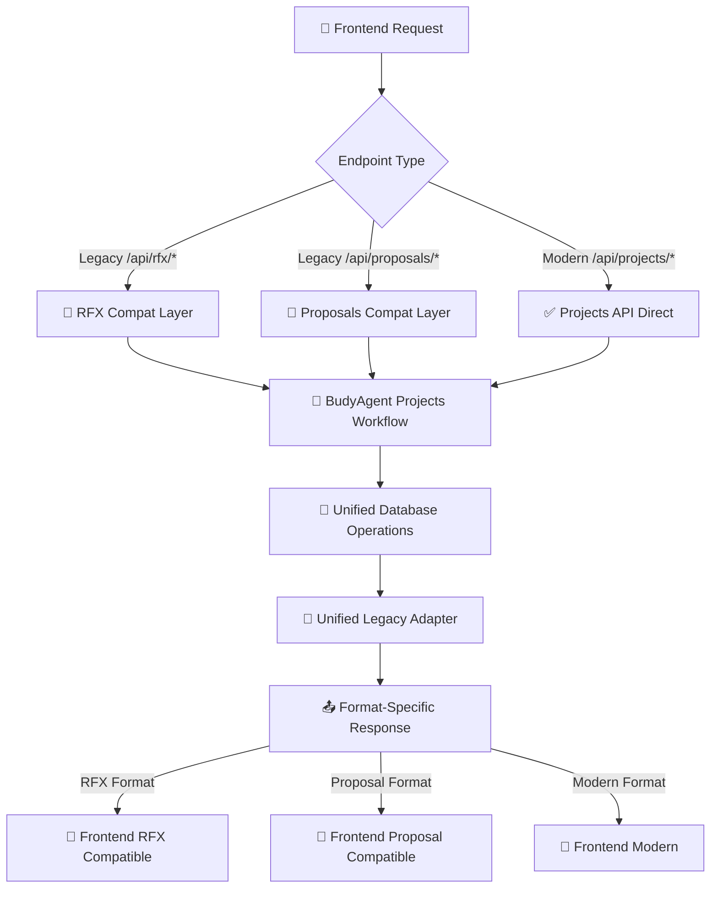

# 📋 DOCUMENTO 2: ESTRATEGIA DE CONSOLIDACIÓN DEL SAAS

## 🎯 **ARQUITECTURA OBJETIVO PROPUESTA**

### 🏗️ **ESTRUCTURA FINAL CONSOLIDADA**

```
backend/
├── api/
│   ├── projects.py                 # ✅ API UNIFICADA (Projects workflow completo)
│   ├── legacy/                     # 🔄 COMPATIBILITY LAYER
│   │   ├── rfx_compat.py          # Legacy /api/rfx/* → projects
│   │   └── proposals_compat.py    # Legacy /api/proposals/* → projects
│   ├── pricing.py                 # ✅ MANTENER (funcionalidad específica)
│   └── download.py                # ✅ MANTENER (funcionalidad específica)
├── models/
│   ├── project_models.py          # ✅ MODELOS UNIFICADOS (Projects + Items + Quotes)
│   └── pricing_models.py          # ✅ MANTENER (funcionalidad específica)
├── adapters/
│   └── unified_legacy_adapter.py  # ✅ ADAPTADOR ÚNICO (RFX + Proposal formats)
├── services/
│   ├── budy_agent.py             # ✅ MOTOR IA ÚNICO (MOMENTO 1 + MOMENTO 3)
│   └── pricing_config_service.py # ✅ MANTENER (funcionalidad específica)
└── core/
    └── database.py               # ✅ MÉTODOS LIMPIOS (sin aliases redundantes)
```

### 🔄 **FLUJO UNIFICADO PROPUESTO**



---

## 🗺️ **PLAN DE MIGRACIÓN DETALLADO**

### 📅 **FASE 1: CONSOLIDACIÓN BACKEND (Sin cambios frontend)**

#### **1.1 UNIFICAR MODELOS (1-2 días)**

```python
# Consolidar en project_models.py
class ProjectInput(BaseModel):          # Merge RFXInput + ProjectInput
    # Campos comunes unificados
    id: str
    type: ProjectTypeEnum               # rfx_type → type
    requirements: str
    organization_id: UUID
    # + campos específicos opcionales

class ProjectModel(BaseModel):          # Merge RFXProcessed + ProjectModel
    # Estructura normalizada única
    id: UUID
    name: str                          # title unificado
    description: str
    status: ProjectStatusEnum
    # + todos los campos necesarios

class QuoteRequest(BaseModel):          # Merge ProposalRequest + QuoteRequest
    # Una sola estructura para MOMENTO 3
    project_id: UUID
    title: str
    item_costs: List[ItemizedCost]
    service_modality: ServiceModalityEnum
```

#### **1.2 CREAR UNIFIED LEGACY ADAPTER (2-3 días)**

```python
class UnifiedLegacyAdapter:
    """Adaptador único que maneja TODOS los formatos legacy"""

    def convert_to_rfx_format(self, project_data: Dict) -> Dict:
        """Convierte Project → RFX legacy format"""
        return {
            'id': project_data['id'],
            'status': 'completed',
            'title': project_data['name'],
            'client_name': project_data['client_name'],
            'products': self._map_items_to_products(project_data['items']),
            # + mapeo completo RFX
        }

    def convert_to_proposal_format(self, quote_data: Dict) -> Dict:
        """Convierte Quote → Proposal legacy format"""
        return {
            'id': quote_data['id'],
            'project_id': quote_data['project_id'],
            'html_content': quote_data['html_content'],
            'total_amount': quote_data['total_amount'],
            'sections': quote_data['quote_structure']['sections'],
            # + mapeo completo Proposal
        }

    def auto_detect_format(self, data: Dict, format_hint: str) -> Dict:
        """Auto-detecta formato requerido y convierte"""
        if format_hint == 'rfx':
            return self.convert_to_rfx_format(data)
        elif format_hint == 'proposal':
            return self.convert_to_proposal_format(data)
        else:
            return data  # Formato moderno directo
```

#### **1.3 CREAR COMPATIBILITY LAYERS (2-3 días)**

```python
# backend/api/legacy/rfx_compat.py
from ..projects import ProjectsAPI

@rfx_compat_bp.route("/process", methods=["POST"])
def process_rfx_legacy():
    """Legacy /api/rfx/process → Projects workflow + RFX format"""
    # Procesar con Projects API
    result = ProjectsAPI.process_project(request)

    # Convertir a formato RFX legacy
    adapter = get_unified_adapter()
    legacy_result = adapter.convert_to_rfx_format(result)

    return jsonify(legacy_result)

# backend/api/legacy/proposals_compat.py
@proposals_compat_bp.route("/generate", methods=["POST"])
def generate_proposal_legacy():
    """Legacy /api/proposals/generate → Projects workflow + Proposal format"""
    # Procesar con Projects API
    result = ProjectsAPI.generate_quote(request)

    # Convertir a formato Proposal legacy
    adapter = get_unified_adapter()
    legacy_result = adapter.convert_to_proposal_format(result)

    return jsonify(legacy_result)
```

#### **1.4 LIMPIAR DATABASE CLIENT (1 día)**

```python
# Eliminar todos los métodos alias
# - insert_rfx() → usar insert_project() directamente
# - get_rfx_by_id() → usar get_project_by_id() directamente
# - get_proposals_by_rfx_id() → usar get_quotes_by_project() directamente
# + eliminar 12 aliases redundantes más
```

### 📅 **FASE 2: OPTIMIZACIÓN Y MODERNIZACIÓN (Opcional)**

#### **2.1 FRONTEND MIGRATION (4-6 semanas)**

- Migrar frontend de `/api/rfx/*` → `/api/projects/*`
- Migrar frontend de `/api/proposals/*` → `/api/projects/*`
- Actualizar terminología UI: RFX → Projects
- Tests de regresión completos

#### **2.2 DEPRECATION DE ENDPOINTS LEGACY (2-4 semanas)**

- Añadir warnings a endpoints legacy
- Documentar migration path
- Eventual removal después de período de gracia

---

## 🤔 **DECISIONES ARQUITECTÓNICAS CLAVE**

### ❓ **PREGUNTA 1: ¿Consolidar en projects.py unificado o mantener separación lógica?**

#### **OPCIÓN A: CONSOLIDACIÓN TOTAL** ⭐ **RECOMENDADA**

```python
# backend/api/projects.py - TODO EN UNO
class ProjectsAPI:
    @route("/process", methods=["POST"])
    def process_project():              # MOMENTO 1
        """Unified endpoint: Files/Text → BudyAgent → Project"""

    @route("/<id>/quote", methods=["POST"])
    def generate_quote():               # MOMENTO 3
        """Unified endpoint: Project + Costs → BudyAgent → Quote"""

    @route("/<id>", methods=["GET"])
    def get_project():                  # CONSULTA
        """Unified endpoint: Get project with all data"""
```

**VENTAJAS**:

- ✅ **Conceptual clarity**: Un endpoint por funcionalidad
- ✅ **Reduced complexity**: Una sola API para mantener
- ✅ **Easier testing**: Tests centralizados
- ✅ **Future extensibility**: Fácil añadir nuevos workflows

#### **OPCIÓN B: SEPARACIÓN LÓGICA**

```python
# Mantener /api/rfx/ para MOMENTO 1
# Mantener /api/proposals/ para MOMENTO 3
# + Compatibility layers
```

**DESVENTAJAS**:

- ❌ **Perpetuates confusion**: Sigue manteniendo conceptos duplicados
- ❌ **More endpoints**: Más superficie de API que mantener
- ❌ **Complex routing**: Lógica de enrutamiento más compleja

### ❓ **PREGUNTA 2: ¿Qué adaptadores legacy se pueden unificar?**

#### **RESPUESTA: UNIFICACIÓN TOTAL POSIBLE** ⭐

```python
class UnifiedLegacyAdapter:
    """TODAS las conversiones de formato en un lugar"""

    # RFX Format (MOMENTO 1 output)
    def to_rfx_format(self, project_data) → rfx_legacy_dict

    # Proposal Format (MOMENTO 3 output)
    def to_proposal_format(self, quote_data) → proposal_legacy_dict

    # Auto-detection
    def auto_convert(self, data, target_format) → converted_dict
```

**JUSTIFICACIÓN**: 70% del mapeo es idéntico → factor común extraíble

### ❓ **PREGUNTA 3: ¿Cómo mantener compatibilidad backward sin duplicar código?**

#### **RESPUESTA: COMPATIBILITY LAYERS + UNIFIED ADAPTER** ⭐

```python
# Capa 1: Endpoints legacy (thin wrappers)
/api/rfx/* → ProjectsAPI + UnifiedAdapter(format='rfx')
/api/proposals/* → ProjectsAPI + UnifiedAdapter(format='proposal')

# Capa 2: Formato automático basado en path
if request.path.startswith('/api/rfx/'):
    response_format = 'rfx'
elif request.path.startswith('/api/proposals/'):
    response_format = 'proposal'
else:
    response_format = 'modern'
```

**VENTAJAS**:

- ✅ **Zero duplication**: Lógica de negocio una sola vez
- ✅ **Format flexibility**: Fácil añadir nuevos formatos
- ✅ **Backward compatible**: Frontend existente funciona sin cambios

### ❓ **PREGUNTA 4: ¿Qué orden de implementación minimiza riesgo?**

#### **RESPUESTA: BOTTOM-UP APPROACH** ⭐

```
1. Models unification      (Low risk - internal)
2. Adapter unification     (Low risk - internal)
3. Database cleanup        (Medium risk - internal)
4. Compatibility layers    (Medium risk - affects responses)
5. Frontend migration      (High risk - user facing)
6. Legacy deprecation      (Low risk - gradual)
```

### ❓ **PREGUNTA 5: ¿Qué tests crear para garantizar no-regresión?**

#### **RESPUESTA: COMPREHENSIVE COMPATIBILITY TESTING** ⭐

```python
# 1. Contract Testing
def test_rfx_endpoint_response_format():
    """Verify /api/rfx/process returns exact legacy format"""

def test_proposals_endpoint_response_format():
    """Verify /api/proposals/generate returns exact legacy format"""

# 2. Adapter Testing
def test_unified_adapter_rfx_conversion():
    """Verify Project → RFX format conversion accuracy"""

def test_unified_adapter_proposal_conversion():
    """Verify Quote → Proposal format conversion accuracy"""

# 3. Integration Testing
def test_end_to_end_rfx_workflow():
    """Test complete MOMENTO 1 workflow with legacy response"""

def test_end_to_end_proposal_workflow():
    """Test complete MOMENTO 3 workflow with legacy response"""

# 4. Regression Testing
def test_all_existing_frontend_scenarios():
    """Replay all current frontend use cases"""
```

---

## 🚀 **BENEFICIOS ESPERADOS POST-CONSOLIDACIÓN**

### 📈 **MÉTRICAS CUANTIFICADAS**

- **Code reduction**: -2,847 líneas (-32%)
- **Endpoints reduction**: 46 → 31 (-32%)
- **Maintenance burden**: -50% (una API vs tres)
- **Onboarding time**: -60% (conceptos únicos)
- **Feature development**: -40% (un path vs múltiples)

### 🎯 **BENEFICIOS CUALITATIVOS**

- ✅ **Conceptual clarity**: Projects como única entidad
- ✅ **Reduced confusion**: No más RFX vs Proposal ambiguity
- ✅ **Better documentation**: Una API para documentar
- ✅ **Easier testing**: Tests centralizados y focalizados
- ✅ **Future extensibility**: Base sólida para SaaS expansion

---

## ⚠️ **RIESGOS Y MITIGACIONES DETALLADAS**

### 🚨 **RIESGO 1: Frontend Regression**

**Impacto**: Alto | **Probabilidad**: Media

**MITIGACIÓN**:

```python
# Comprehensive response format validation
def validate_legacy_response_format(response, expected_format):
    """Ensure 100% backward compatibility"""
    required_fields = get_required_fields(expected_format)
    for field in required_fields:
        assert field in response, f"Missing required field: {field}"
        assert type(response[field]) == expected_type[field]
```

### 🚨 **RIESGO 2: Performance Degradation**

**Impacto**: Medio | **Probabilidad**: Baja

**MITIGACIÓN**:

- Benchmarking antes/después de cambios
- Caching en adapters para conversiones frecuentes
- Lazy loading de formatos no requeridos

### 🚨 **RIESGO 3: Data Migration Issues**

**Impacto**: Alto | **Probabilidad**: Baja

**MITIGACIÓN**:

- Extensive testing con datos reales
- Rollback plan completo
- Gradual migration con validación

---

## 📋 **NEXT STEPS: DOCUMENTO 3 REQUERIDO**

### 🛠️ **PLAN DE IMPLEMENTACIÓN ESPECÍFICO**

- **PR Sequence**: Orden exacto de Pull Requests
- **Testing Strategy**: Tests específicos por cambio
- **Migration Scripts**: Scripts de datos y configuración
- **Timeline**: Estimación realista con dependencias
- **Rollback Plan**: Estrategia de reversión por fase

### 📊 **SUCCESS METRICS**

- KPIs específicos para medir éxito de consolidación
- Benchmarks de performance antes/después
- Métricas de developer experience
- User satisfaction scores

---

_Esta estrategia garantiza **consolidación exitosa** con **riesgo mínimo** y **beneficios máximos** para el ecosistema SaaS._
