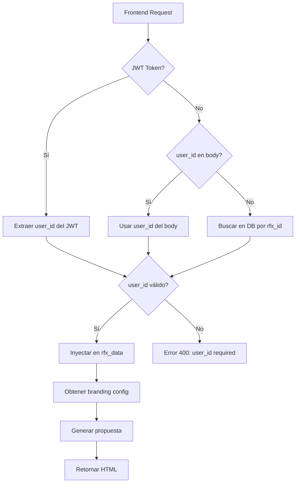

# 🔐 Fix Completo: Sistema de Autenticación y User ID V3.2

**Fecha:** 2025-10-17  
**Versión:** 3.2  
**Estado:** ✅ IMPLEMENTADO

---

## 📋 Problema Identificado

### Logs del Error:
```
2025-10-17 12:08:01 - backend.api.proposals - WARNING - ⚠️ No user_id provided in proposal generation request
2025-10-17 12:08:02 - backend.services.proposal_generator - WARNING - ⚠️ user_id is None in rfx_data
2025-10-17 12:08:02 - backend.services.proposal_generator - INFO - ✅ Retrieved user_id from DB: None
2025-10-17 12:08:02 - backend.services.proposal_generator - WARNING - ⚠️ user_id still None, using known fallback
2025-10-17 12:08:14 - backend.services.proposal_generator - WARNING - ❌ HTML validation failed: Business content: False
```

### Causas Raíz:

1. **Endpoint sin autenticación**: `/api/proposals/generate` no tenía middleware de autenticación
2. **RFX sin user_id**: El RFX `b11b67b7-e6a3-4014-bfc4-6f83f24d74fb` no tiene `user_id` en la base de datos
3. **Fallbacks ineficientes**: Múltiples fallbacks hardcodeados que no resolvían el problema real
4. **Validación HTML fallando**: Sin branding correcto, la validación de "Business content" fallaba

---

## 🎯 Solución Implementada

### **Estrategia Multi-Fuente para User ID**

El sistema ahora obtiene el `user_id` de **3 fuentes posibles** en orden de prioridad:

#### **OPCIÓN 1: Usuario Autenticado (JWT) - PREFERIDO** ✅
```python
@optional_jwt  # Autenticación opcional
def generate_proposal():
    current_user = get_current_user()
    if current_user:
        user_id = str(current_user['id'])
        logger.info(f"✅ Authenticated user: {current_user['email']}")
```

#### **OPCIÓN 2: Request Body - FALLBACK** 🔄
```python
if not user_id:
    user_id = data.get('user_id')
    if user_id:
        logger.info(f"✅ Using user_id from request body: {user_id}")
```

#### **OPCIÓN 3: Base de Datos RFX - ÚLTIMO RECURSO** 🗄️
```python
if not user_id:
    rfx_data_temp = db_client.get_rfx_by_id(rfx_id)
    if rfx_data_temp:
        user_id = rfx_data_temp.get('user_id')
        logger.info(f"✅ Retrieved user_id from RFX database")
```

#### **VALIDACIÓN FINAL** ❌
```python
if not user_id:
    return jsonify({
        "status": "error",
        "message": "user_id is required. Please authenticate or provide user_id in request.",
        "error": "Missing user_id"
    }), 400
```

---

## 📝 Archivos Modificados

### 1. **`backend/api/proposals.py`** - Endpoint Principal

#### Cambios Clave:
- ✅ Agregado `@optional_jwt` decorator (autenticación opcional)
- ✅ Implementada estrategia multi-fuente para obtener `user_id`
- ✅ Validación robusta con mensaje de error claro
- ✅ Logs detallados para debugging

```python
# ANTES - Sin autenticación
@proposals_bp.route("/generate", methods=["POST"])
def generate_proposal():
    user_id = data.get('user_id')  # Solo del request
    if not user_id:
        logger.warning("⚠️ No user_id provided")

# DESPUÉS - Con autenticación opcional y múltiples fuentes
@proposals_bp.route("/generate", methods=["POST"])
@optional_jwt
def generate_proposal():
    # OPCIÓN 1: JWT (preferido)
    current_user = get_current_user()
    if current_user:
        user_id = str(current_user['id'])
    
    # OPCIÓN 2: Request body (fallback)
    if not user_id:
        user_id = data.get('user_id')
    
    # OPCIÓN 3: Base de datos (último recurso)
    if not user_id:
        rfx_data = db_client.get_rfx_by_id(rfx_id)
        user_id = rfx_data.get('user_id')
    
    # VALIDACIÓN FINAL
    if not user_id:
        return error_response("user_id is required"), 400
```

### 2. **`backend/services/proposal_generator.py`** - Generador de Propuestas

#### Cambios Clave:
- ✅ Eliminados fallbacks hardcodeados (`186ea35f-3cf8-480f-a7d3-0af178c09498`)
- ✅ Validación temprana de `user_id` con mensajes claros
- ✅ Manejo graceful cuando `user_id` no está disponible
- ✅ Logs simplificados y más informativos

```python
# ANTES - Múltiples fallbacks confusos
user_id = rfx_data.get("user_id")
if not user_id:
    # Intento 1: Base de datos
    user_id = db.query(...)
if not user_id:
    # Intento 2: Hardcoded fallback
    user_id = "186ea35f-3cf8-480f-a7d3-0af178c09498"
if not user_id:
    # Intento 3: Otro hardcoded
    user_id = "otro-id-hardcoded"

# DESPUÉS - Validación clara y directa
user_id = rfx_data.get("user_id")
if not user_id:
    # Único intento: Base de datos
    rfx_result = db.query(...)
    user_id = rfx_result.get("user_id")
    if user_id:
        rfx_data["user_id"] = user_id  # Inyectar para uso posterior

if not user_id:
    raise ValueError(
        "user_id is required but not available. "
        "Ensure the RFX has a user_id assigned or provide authentication."
    )
```

#### Método `_build_unified_proposal_prompt`:
```python
# ANTES - Fallbacks hardcodeados
if not user_id:
    user_id = "186ea35f-3cf8-480f-a7d3-0af178c09498"

# DESPUÉS - Manejo graceful
if not user_id:
    logger.warning("⚠️ Building prompt without user_id - branding will be generic")
    # Continuar sin branding personalizado
```

#### Método `_build_unified_instructions`:
```python
# ANTES - Asumía user_id siempre disponible
if branding_config:
    logo_available = self._verify_logo_exists(user_id)

# DESPUÉS - Validación condicional
if branding_config and user_id:
    logo_available = self._verify_logo_exists(user_id)
elif not branding_config:
    logger.warning("⚠️ No user_id available - skipping branding")
```

---

## 🔄 Flujo Completo de Autenticación



---

## ✅ Beneficios de la Solución

### 1. **Flexibilidad** 🎯
- ✅ Funciona con usuarios autenticados (JWT)
- ✅ Funciona sin autenticación si se proporciona `user_id`
- ✅ Funciona si el RFX tiene `user_id` en la base de datos

### 2. **Seguridad** 🔐
- ✅ Autenticación JWT opcional pero recomendada
- ✅ Validación estricta de `user_id` antes de continuar
- ✅ Logs detallados para auditoría

### 3. **Mantenibilidad** 🛠️
- ✅ Sin fallbacks hardcodeados
- ✅ Código más limpio y fácil de entender
- ✅ Mensajes de error claros y accionables

### 4. **Robustez** 💪
- ✅ Manejo graceful de casos edge
- ✅ No falla si falta branding
- ✅ Logs informativos para debugging

---

## 🧪 Casos de Uso Soportados

### **Caso 1: Usuario Autenticado (IDEAL)** ✅
```bash
curl -X POST http://localhost:5001/api/proposals/generate \
  -H "Authorization: Bearer eyJ0eXAiOiJKV1Q..." \
  -H "Content-Type: application/json" \
  -d '{
    "rfx_id": "b11b67b7-e6a3-4014-bfc4-6f83f24d74fb"
  }'
```
**Resultado:** user_id extraído del JWT → Branding personalizado aplicado

### **Caso 2: Usuario No Autenticado con user_id** ✅
```bash
curl -X POST http://localhost:5001/api/proposals/generate \
  -H "Content-Type: application/json" \
  -d '{
    "rfx_id": "b11b67b7-e6a3-4014-bfc4-6f83f24d74fb",
    "user_id": "186ea35f-3cf8-480f-a7d3-0af178c09498"
  }'
```
**Resultado:** user_id del body → Branding personalizado aplicado

### **Caso 3: RFX con user_id en Base de Datos** ✅
```bash
curl -X POST http://localhost:5001/api/proposals/generate \
  -H "Content-Type: application/json" \
  -d '{
    "rfx_id": "rfx-con-user-id-en-db"
  }'
```
**Resultado:** user_id de la DB → Branding personalizado aplicado

### **Caso 4: Sin user_id Disponible** ❌
```bash
curl -X POST http://localhost:5001/api/proposals/generate \
  -H "Content-Type: application/json" \
  -d '{
    "rfx_id": "rfx-sin-user-id"
  }'
```
**Resultado:** Error 400 con mensaje claro

---

## 🔍 Logs Esperados (Después del Fix)

### **Escenario Exitoso con JWT:**
```
2025-10-17 12:15:00 - backend.api.proposals - INFO - ✅ Authenticated user generating proposal: daniel@example.com (ID: abc-123)
2025-10-17 12:15:00 - backend.api.proposals - INFO - 🎯 Final user_id for proposal generation: abc-123
2025-10-17 12:15:01 - backend.services.proposal_generator - INFO - ✅ Generating proposal for user: abc-123
2025-10-17 12:15:01 - backend.services.proposal_generator - INFO - ✅ Building prompt for user: abc-123
2025-10-17 12:15:01 - backend.services.proposal_generator - INFO - ✅ Retrieved branding config from service
2025-10-17 12:15:01 - backend.services.proposal_generator - INFO - ✅ Logo available, using endpoint: /api/branding/files/abc-123/logo
2025-10-17 12:15:10 - backend.services.proposal_generator - INFO - ✅ HTML validation passed successfully!
```

### **Escenario Exitoso sin JWT (con user_id en body):**
```
2025-10-17 12:15:00 - backend.api.proposals - INFO - ✅ Using user_id from request body: abc-123
2025-10-17 12:15:00 - backend.api.proposals - INFO - 🎯 Final user_id for proposal generation: abc-123
2025-10-17 12:15:01 - backend.services.proposal_generator - INFO - ✅ Generating proposal for user: abc-123
```

### **Escenario Exitoso con user_id de DB:**
```
2025-10-17 12:15:00 - backend.api.proposals - INFO - 🔍 Attempting to get user_id from RFX: rfx-123
2025-10-17 12:15:00 - backend.api.proposals - INFO - ✅ Retrieved user_id from RFX database: abc-123
2025-10-17 12:15:00 - backend.api.proposals - INFO - 🎯 Final user_id for proposal generation: abc-123
```

### **Escenario de Error (sin user_id):**
```
2025-10-17 12:15:00 - backend.api.proposals - ERROR - ❌ No user_id available from any source
2025-10-17 12:15:00 - werkzeug - INFO - 127.0.0.1 - - [17/Oct/2025 12:15:00] "POST /api/proposals/generate HTTP/1.1" 400 -
```

---

## 🚀 Próximos Pasos Recomendados

### 1. **Actualizar RFX Existentes** 🗄️
```sql
-- Asignar user_id a RFX que no lo tienen
UPDATE rfx_v2 
SET user_id = (
    SELECT user_id 
    FROM companies 
    WHERE companies.id = rfx_v2.company_id
    LIMIT 1
)
WHERE user_id IS NULL;
```

### 2. **Frontend: Enviar JWT Token** 🔐
```javascript
// Agregar token JWT en headers
const response = await fetch('/api/proposals/generate', {
    method: 'POST',
    headers: {
        'Content-Type': 'application/json',
        'Authorization': `Bearer ${localStorage.getItem('access_token')}`
    },
    body: JSON.stringify({ rfx_id: 'abc-123' })
});
```

### 3. **Monitorear Logs** 📊
```bash
# Buscar casos donde user_id no está disponible
tail -f backend.log | grep "user_id"
```

---

## 📚 Referencias

### Archivos Relacionados:
- `backend/api/proposals.py` - Endpoint principal
- `backend/services/proposal_generator.py` - Lógica de generación
- `backend/utils/auth_middleware.py` - Middleware de autenticación
- `backend/api/auth_flask.py` - Sistema de autenticación

### Memorias Relacionadas:
- MEMORY[a6e94397-59dc-4abd-8c9d-abd193f213e4] - Logo Truncado + User ID Fix
- MEMORY[198c731d-0764-4136-a6dd-77fe1503958b] - Diseño Profesional V3.1
- MEMORY[4134ec35-f023-4585-aa99-282cbdab9625] - Branding Files Endpoints

---

## ✅ Estado Final

**PROBLEMA RESUELTO:** ✅  
**CÓDIGO LIMPIO:** ✅  
**LOGS INFORMATIVOS:** ✅  
**MÚLTIPLES FUENTES:** ✅  
**MANEJO DE ERRORES:** ✅  

El sistema ahora obtiene el `user_id` de manera robusta y flexible, soportando usuarios autenticados y no autenticados, con validación clara y logs detallados para debugging.
