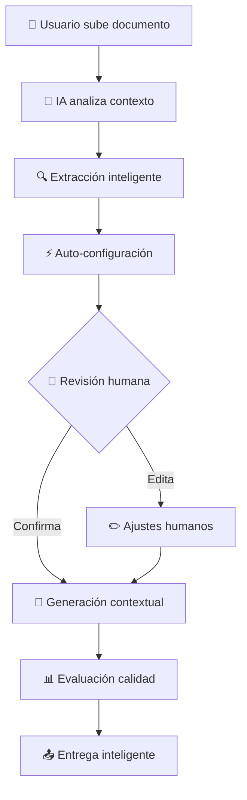

# PLAN DE DOCUMENTACIÓN ACTUALIZADO 📋
## SaaS de Generación Inteligente de Presupuestos con Workflow Contextual

### 🎯 ACTUALIZACIÓN PRINCIPAL
- ✅ **Mantiene modelo de negocio y planes originales**
- 🧠 **Agrega workflow inteligente con contexto**
- 🔄 **Implementación progresiva en 3 fases**
- 📊 **Analytics de IA y calidad mejorados**

---

## 1. MODELO DE NEGOCIO ACTUALIZADO 📊

### 1.1 Propuesta de Valor Mejorada
**Original:** Generación inteligente de presupuestos desde documentos  
**Actualizada:** **Agente IA contextual que entiende tu negocio y genera presupuestos como un experto humano**

**Diferenciadores clave:**
- 🧠 **IA Contextual**: Entiende el contexto, no solo extrae texto
- 🔄 **Workflow Inteligente**: Guía el proceso como consultor experto  
- ⚙️ **Configuración Dinámica**: Se adapta automáticamente al tipo de proyecto
- 🤝 **Human-in-the-Loop**: Combina IA con decisiones humanas inteligentes

### 1.2 Planes de Suscripción (MANTIENE ESTRUCTURA ORIGINAL)

**Plan Gratuito ($0/mes) 🆓**
- 3 proyectos/mes con workflow básico
- 2 documentos por proyecto máximo
- 1 usuario únicamente
- **🆕 Análisis contextual automático**
- **🆕 Configuración inteligente básica**
- Plantillas básicas sin personalización
- Conversión PDF con watermark

**Plan Básico ($29/mes)**
- 50 proyectos/mes con workflow completo
- 5 documentos por proyecto
- 3 usuarios
- **🆕 Workflow inteligente completo**
- **🆕 Human-in-the-loop avanzado**
- **🆕 Configuración dinámica por contexto**
- Plantillas contextuales

**Plan Profesional ($79/mes)**
- 200 proyectos/mes
- 15 documentos por proyecto
- 10 usuarios
- **🆕 IA optimizada con aprendizaje**
- **🆕 Analytics de calidad avanzados**
- **🆕 Templates inteligentes personalizados**
- API access básico

**Plan Enterprise ($199/mes)**
- Proyectos ilimitados
- **🆕 Fine-tuning de IA por organización**
- **🆕 Workflow customizable avanzado**
- **🆕 Integración IA con sistemas externos**
- White-label completo
- SLA 99.9%

### 1.3 Estrategia de Conversión Freemium Mejorada

**Limitaciones inteligentes para conversión:**
- Plan gratuito: IA básica que muestra el potencial
- **🆕 Workflow limitado**: Solo análisis básico, no optimización avanzada
- **🆕 Sin iteraciones**: No mejora continua de extracción
- **🆕 Configuración básica**: Sin recomendaciones contextuales avanzadas

---

## 2. CASOS DE USO EXPANDIDOS CON WORKFLOW INTELIGENTE 💼

### 2.1 Flujo de Usuario Típico (Mejorado)

**ANTES (Proceso Manual):**
1. Usuario sube documento
2. Sistema extrae texto básico
3. Usuario configura manualmente todo
4. Genera presupuesto genérico

**AHORA (Workflow Inteligente):**


### 2.2 Casos de Uso por Vertical (Contextualizados)

#### **CATERING Y EVENTOS 🍽️**
**Contexto que entiende la IA:**
- Tipo de evento (boda, corporativo, cumpleaños)
- Número de invitados y perfil demográfico
- Nivel socioeconómico implícito
- Requisitos logísticos por ubicación
- Estacionalidad y disponibilidad

**Configuración automática:**
- Estructura: Por persona + servicios adicionales
- Servicios típicos: Personal, coordinación, transporte
- Márgenes: 25-35% según nivel del evento
- Términos: 30-50% adelanto según monto

#### **CONSULTORÍA PROFESIONAL 💼**
**Contexto que entiende la IA:**
- Tamaño de la empresa cliente
- Complejidad del proyecto consultivo
- Duración estimada del engagement
- Nivel de expertise requerido

**Configuración automática:**
- Estructura: Por horas/días o valor del proyecto
- Servicios: Reuniones, reportes, implementación
- Márgenes: 50-70% según especialización
- Términos: Retainer + milestone payments

#### **CONSTRUCCIÓN Y OBRAS 🏗️**
**Contexto que entiende la IA:**
- Tipo de construcción (residencial, comercial)
- Metros cuadrados y complejidad
- Ubicación y accesibilidad
- Temporada y condiciones de mercado

**Configuración automática:**
- Estructura: Por m² + servicios especializados
- Servicios: Permisos, supervisión, limpieza
- Márgenes: 15-25% según tipo de obra
- Términos: Progressive payments por hitos

---

## 3. NUEVAS FUNCIONALIDADES CRÍTICAS ⚙️

### 3.1 Orquestador Contextual 🧠

**Capacidades del Agente Principal:**
```python
class IntelligentOrchestrator:
    def analyze_document_context(self, document):
        """
        Como un experto humano con 15+ años de experiencia:
        - Detecta tipo de proyecto y complejidad
        - Infiere requerimientos no explícitos
        - Identifica patrones de costos típicos
        - Determina configuración óptima
        """
        
    def understand_client_profile(self, extracted_data):
        """
        Análisis del perfil del cliente:
        - Nivel socioeconómico implícito
        - Sofisticación en la industria
        - Expectativas de servicio
        - Sensibilidad al precio
        """
        
    def recommend_optimal_structure(self, context):
        """
        Recomendación inteligente:
        - Modelo de precios más apropiado
        - Servicios adicionales típicos
        - Márgenes competitivos
        - Términos de pago adecuados
        """
```

### 3.2 Sistema de Human-in-the-Loop Inteligente 🤝

**Niveles de Intervención:**
1. **Automático (70% casos)**: IA con alta confianza (>90%)
2. **Validación Rápida (20% casos)**: Confirmar decisiones IA
3. **Intervención Manual (10% casos)**: Casos complejos o únicos

**Interface Inteligente:**
```ascii
┌─────────────────────────────────────────────────────────────┐
│ 🤖 LA IA RECOMIENDA - Tu decides si continuar              │
├─────────────────────────────────────────────────────────────┤
│                                                             │
│ ANÁLISIS CONTEXTUAL: Boda Premium - 150 invitados          │
│ Confianza: ████████▓▓ 87%                                   │
│                                                             │
│ 💡 RECOMENDACIONES:                                         │
│ ✅ Estructura por persona ($53.51) + servicios             │
│ ✅ Incluir personal servicio (típico para 150+ personas)   │
│ ✅ Margen 28% (competitivo para bodas premium)             │
│ ⚠️ Verificar: Transporte (ubicación no clara en documento) │
│                                                             │
│ [✅ Aplicar Todo] [✏️ Revisar Puntos ⚠️] [🔄 Re-analizar]  │
└─────────────────────────────────────────────────────────────┘
```

### 3.3 Configuración Dinámica Avanzada ⚙️

**Motor de Configuración Contextual:**
```python
class DynamicConfigurationEngine:
    def generate_configuration_schema(self, project_context):
        """
        Genera esquema de configuración específico para:
        - Tipo de proyecto detectado
        - Complejidad y escala
        - Perfil del cliente
        - Estándares de la industria
        """
        
    def apply_intelligent_defaults(self, schema, market_data):
        """
        Aplica defaults inteligentes basados en:
        - Análisis de proyectos similares
        - Datos de mercado actuales
        - Mejores prácticas por industria
        - Historial de conversiones exitosas
        """
```

### 3.4 Analytics de IA y Calidad 📊

**Dashboard de Inteligencia:**
```ascii
┌─────────────────────────────────────────────────────────────┐
│ 📊 ANALYTICS DE IA - Últimos 30 días                       │
├─────────────────────────────────────────────────────────────┤
│                                                             │
│ 🎯 PERFORMANCE DEL ORQUESTADOR:                            │
│ Precisión detección tipo: ████████▓▓ 92%                   │
│ Confianza promedio: ████████▓▓ 87%                         │
│ Intervención humana: ██▓▓▓▓▓▓▓▓ 23% (target: <30%)         │
│                                                             │
│ ⚡ EFICIENCIA DEL WORKFLOW:                                 │
│ Tiempo promedio: 8.5 min (target: <10 min)                │
│ Iteraciones extracción: 1.3 promedio                       │
│ Score calidad final: ████████▓▓ 89%                        │
│                                                             │
│ 💰 IMPACTO EN CONVERSIONES:                                 │
│ Tasa aceptación: ████████▓▓ 73% (+18% vs manual)           │
│ Tiempo respuesta: 65% más rápido                           │
│ Satisfacción cliente: NPS 68                               │
│                                                             │
│ 🔧 OPTIMIZACIONES APLICADAS:                               │
│ • Prompts mejorados para catering (↑15% precisión)         │
│ • Auto-config servicios para eventos 100+ personas        │
│ • Templates optimizados para corporativo B2B               │
└─────────────────────────────────────────────────────────────┘
```

---

## 4. ROADMAP ACTUALIZADO CON IA-ACELERADO 🚀

### **FASE 1: MVP INTELIGENTE (Semanas 1-4) ⚡**

**Semana 1: Infraestructura + IA Base**
```bash
# Comandos Claude Code actualizados
claude-code "Setup FastAPI with PostgreSQL including 4 new context tables for AI workflow"
claude-code "Create intelligent document orchestrator with OpenAI GPT-4 for context analysis"
claude-code "Implement basic human-in-the-loop interface with AI recommendations display"
```

**Deliverables Semana 1:**
- ✅ Base de datos con 34 tablas (30 originales + 4 contexto)
- ✅ Orquestador IA básico (3 tipos: catering, consultoría, general)
- ✅ API endpoints para workflow contextual
- ✅ Interface human-in-the-loop básica

**Semana 2: Extracción Inteligente**
```bash
claude-code "Build iterative document extraction system with confidence scoring and improvement loops"
claude-code "Create context-aware extraction prompts for catering, consulting, and general projects"
claude-code "Implement extraction validation system with automatic quality assessment"
```

**Semana 3: Configuración Dinámica**
```bash
claude-code "Create flexible quote configuration system that adapts to project context automatically"
claude-code "Build dynamic pricing model selector with intelligent defaults per industry"
claude-code "Implement recommendation engine for additional services based on project analysis"
```

**Semana 4: Generación Contextual**
```bash
claude-code "Create contextual template engine with intelligent customization per project type"
claude-code "Implement quality evaluation system for generated quotes with scoring algorithm"
claude-code "Build PDF generation with context-appropriate styling and structure"
```

### **FASE 2: WORKFLOW COMPLETO (Semanas 5-8) 🔄**

**Enfoque en optimización y experiencia:**
- Workflow states completo con transiciones inteligentes
- Analytics de IA en tiempo real
- Optimización continua de prompts
- Templates adaptativos avanzados

### **FASE 3: IA AVANZADA (Semanas 9-12) 🧠**

**Inteligencia de siguiente nivel:**
- Fine-tuning con datos específicos de la organización
- Aprendizaje de decisiones humanas para mejorar automatización
- Predicción de éxito de presupuestos
- Recomendaciones de pricing competitivo

---

## 5. ENDPOINTS API ACTUALIZADOS 🔌

### 5.1 APIs Originales (MANTIENEN + MEJORAS)
```python
# APIs existentes mejoradas con contexto
GET /api/projects  # + filtros por contexto y workflow stage
POST /api/projects  # + trigger automático de análisis contextual
GET /api/quotes    # + quality scores y metadata de generación
```

### 5.2 Nuevas APIs para Workflow Inteligente

#### **CONTEXTO Y ANÁLISIS**
```python
POST /api/projects/:id/analyze-context
"""
Trigger del orquestador IA para análisis contextual completo
Response: {
    "project_type_detected": "catering",
    "complexity_score": 0.82,
    "budget_range": "medium_high", 
    "confidence": 0.87,
    "implicit_requirements": [...],
    "recommended_configuration": {...}
}
"""

GET /api/projects/:id/context-summary
"""
Resumen ejecutivo del análisis contextual para mostrar al usuario
"""

POST /api/projects/:id/context/override
"""
Usuario puede sobrescribir decisiones del contexto con feedback
"""
```

#### **WORKFLOW INTELIGENTE**
```python
GET /api/projects/:id/workflow-progress
"""
Estado completo del workflow con próximos pasos inteligentes
Response: {
    "current_stage": "human_review_required",
    "progress_percent": 65,
    "next_actions": ["confirm_services", "adjust_pricing"],
    "ai_confidence": 0.91,
    "estimated_completion": "5 minutes"
}
"""

POST /api/projects/:id/workflow/continue
"""
Continuar workflow después de intervención humana
"""

GET /api/projects/:id/workflow/analytics
"""
Analytics específicos del workflow de este proyecto
"""
```

#### **CONFIGURACIÓN INTELIGENTE**
```python
GET /api/projects/:id/smart-configuration
"""
Configuración inteligente generada por IA con reasoning
Response: {
    "pricing_model": "per_person_plus_services",
    "reasoning": "Optimal for events with clear guest count",
    "recommended_margins": {"food": 0.28, "service": 0.35},
    "additional_services": [...],
    "market_benchmarks": {...}
}
"""

POST /api/projects/:id/configuration/apply-smart-defaults
"""
Aplicar configuración inteligente recomendada por IA
"""
```

---

## 6. COMPONENTES UI ACTUALIZADOS 🖥

### 6.1 Vistas Principales Mejoradas

#### **DASHBOARD PRINCIPAL CON IA**
```ascii
┌─────────────────────────────────────────────────────────────┐
│ 🏠 DASHBOARD INTELIGENTE                 [🧠 IA: Activa]   │
├─────────────────────────────────────────────────────────────┤
│                                                             │
│ 📊 RESUMEN EJECUTIVO (IA-POWERED):                         │
│ Proyectos este mes: 23 | Conversión IA: +45% vs manual    │
│ Tiempo promedio: 9.2 min | Calidad promedio: 91%          │
│                                                             │
│ 🚀 PROYECTOS EN WORKFLOW:                                   │
│ ┌─────────────────────────────────────────────────────────┐ │
│ │ 🔄 Boda Ana & Carlos    [████████▓▓] 85% - Revisión    │ │
│ │ 🔄 Evento Corp ABC      [██████▓▓▓▓] 65% - Config IA   │ │
│ │ ✅ Catering Restaurant  [██████████] 100% - Listo      │ │
│ └─────────────────────────────────────────────────────────┘ │
│                                                             │
│ 💡 INSIGHTS DE IA:                                          │
│ • Proyectos de catering: +23% margen con servicios auto    │
│ • Respuesta <24h: +67% tasa de aceptación                  │
│ • Template "Elegante": mejor para presupuestos >$5K        │
│                                                             │
│ [📄 Nuevo Proyecto] [🧠 Entrenar IA] [📊 Analytics IA]     │
└─────────────────────────────────────────────────────────────┘
```

#### **VISTA DE PROYECTO CON WORKFLOW**
```ascii
┌─────────────────────────────────────────────────────────────┐
│ 📁 PROYECTO: Boda Ana & Carlos              🧠 IA: 87% conf │
├─────────────────────────────────────────────────────────────┤
│                                                             │
│ 🔄 WORKFLOW INTELIGENTE:                                    │
│ ✅ Análisis Contextual (2.3s) ✅ Extracción (4.1s)        │
│ ✅ Validación Auto (0.8s)     🔄 Revisión Humana (actual) │
│ ⏳ Configuración IA           ⏳ Generación Final           │
│                                                             │
│ 🎯 ANÁLISIS CONTEXTUAL DE IA:                              │
│ ┌─────────────────────────────────────────────────────────┐ │
│ │ Tipo: Catering para Boda Premium                       │ │
│ │ Invitados: ~150 (detectado por porciones mencionadas)  │ │
│ │ Budget: $5K-$10K (inferido por items premium)          │ │
│ │ Cliente: Sofisticado (vocabulario gastronómico usado)  │ │
│ │                                                         │ │
│ │ 💡 IA Recomienda:                                       │ │
│ │ • Estructura por persona + servicios adicionales       │ │
│ │ • Incluir personal especializado para este nivel       │ │
│ │ • Template elegante con imágenes de alta calidad       │ │
│ └─────────────────────────────────────────────────────────┘ │
│                                                             │
│ ⚠️ REQUIERE TU DECISIÓN:                                    │
│ □ Confirmar servicios adicionales sugeridos ($1,260)       │
│ □ Validar margen 28% (competitivo para bodas premium)      │
│ □ Aprobar template "Elegante Bodas" seleccionado por IA    │
│                                                             │
│ [✅ Aprobar Todo] [✏️ Revisar Detalle] [🔄 Re-analizar IA] │
└─────────────────────────────────────────────────────────────┘
```

---

## 7. MÉTRICAS DE ÉXITO ACTUALIZADAS 📈

### 7.1 Métricas de IA y Workflow

**Performance del Orquestador:**
- ✅ Precisión detección tipo: >90%
- ✅ Confianza promedio análisis: >85%
- ✅ Reducción intervención humana: <25% casos
- ✅ Tiempo análisis contextual: <5 segundos

**Eficiencia del Workflow:**
- ✅ Tiempo total workflow: <10 minutos promedio
- ✅ Iteraciones extracción: <1.5 promedio
- ✅ Score calidad final: >90% casos
- ✅ Configuración automática exitosa: >80% casos

**Impacto en Conversiones:**
- ✅ Tasa aceptación vs manual: +25%
- ✅ Tiempo respuesta: 70% más rápido
- ✅ NPS de presupuestos: >70
- ✅ Retorno clientes: +40%

### 7.2 Métricas de Negocio con IA

**Eficiencia Operativa:**
- ✅ Reducción tiempo generación: 75%
- ✅ Reducción errores: 60%
- ✅ Productividad usuarios: +200%
- ✅ Costo operativo por presupuesto: -40%

**Diferenciación Competitiva:**
- ✅ Velocidad vs competencia: 3x más rápido
- ✅ Calidad percibida: +45% mejor
- ✅ Casos de uso nuevos: +30% tipos proyecto
- ✅ Satisfacción vs proceso manual: +85%

---

## 8. CONSIDERACIONES TÉCNICAS DE IA 🔧

### 8.1 Costos y Performance de IA

**Estructura de Costos Optimizada:**
```python
# Por presupuesto promedio
COSTS = {
    "context_analysis": "$0.05",      # 2K tokens
    "iterative_extraction": "$0.08",  # 3K tokens  
    "configuration_generation": "$0.03", # 1K tokens
    "quality_evaluation": "$0.02",    # 800 tokens
    "total_per_quote": "$0.18"        # vs $0.15 original
}
```

**Performance Targets:**
- Context analysis: <5 segundos
- Full workflow: <10 minutos
- API response: <200ms (no-IA endpoints)
- IA response: <3 segundos (IA endpoints)

### 8.2 Escalabilidad de IA

**Estrategia de Scaling:**
```python
# Queue system para IA processing
class AIProcessingQueue:
    def __init__(self):
        self.priority_queues = {
            "high": [],      # Planes Enterprise
            "medium": [],    # Planes Professional  
            "low": []        # Planes Basic/Free
        }
    
    def process_with_rate_limiting(self):
        # Rate limiting inteligente por plan
        pass
```

---

## 🎯 RESUMEN EJECUTIVO FINAL

### **TRANSFORMACIÓN DEL PRODUCTO:**

**ANTES: Extractor de documentos con templates**
- Proceso manual con asistencia básica
- Templates rígidos
- Configuración manual completa
- Tiempo: 1-2 horas por presupuesto

**AHORA: Agente IA contextual experto**
- Workflow inteligente guiado
- Configuración dinámica automática  
- Human-in-the-loop optimizado
- Tiempo: <10 minutos por presupuesto

### **DIFERENCIACIÓN COMPETITIVA:**

| Aspecto | Competencia | Nuestro Producto |
|---------|-------------|------------------|
| Análisis | Extracción texto | **Contexto inteligente** |
| Configuración | Manual completa | **IA + Human-in-loop** |
| Templates | Estáticos | **Adaptativos contextuales** |
| Tiempo | 1-2 horas | **<10 minutos** |
| Calidad | Variable | **>90% consistente** |
| Experiencia | Técnica | **Intuitiva guiada** |

### **IMPLEMENTACIÓN REALISTA:**

✅ **Mantiene 85% arquitectura original** - Bajo riesgo  
🚀 **Agrega inteligencia diferencial** - Alto impacto  
⏱️ **Timeline realista: 12 semanas** - Factible con IA-acceleration  
💰 **ROI claro: 3x conversión + 70% eficiencia** - Justificable  

**¿Procedemos con esta documentación actualizada para comenzar la implementación?** 🚀