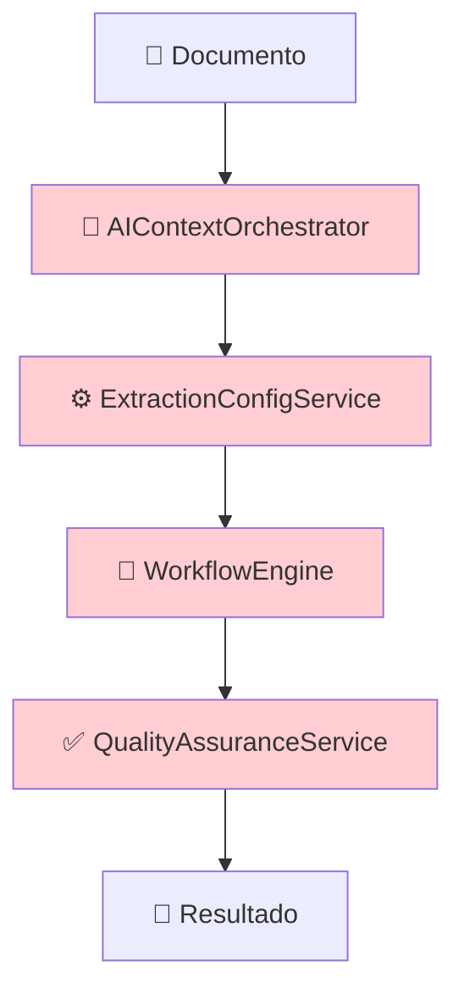
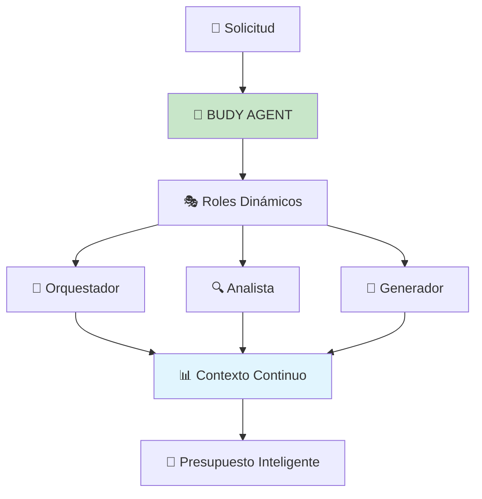

# 📋 DOCUMENTACIÓN CONCEPTUAL: REFACTORIZACIÓN A WORKFLOW AGÉNTICO BUDY

## 🎯 RESUMEN EJECUTIVO

### PROBLEMA ACTUAL

La implementación actual del sistema de generación de presupuestos utiliza una arquitectura fragmentada con múltiples servicios independientes que no proporcionan verdadera inteligencia contextual.

### SOLUCIÓN PROPUESTA

Reemplazar completamente la arquitectura actual con un **agente inteligente único (BUDY)** que adopta diferentes roles dinámicamente, manteniendo contexto continuo y proporcionando inteligencia contextual real.

### BENEFICIO CLAVE

Transformar de un sistema de "extracción de texto con reglas" a un **"experto IA que comprende y razona"**.

---

## 🚨 ANÁLISIS DEL PROBLEMA ACTUAL

### ARQUITECTURA FRAGMENTADA IMPLEMENTADA (DÍA 6)



### PROBLEMAS CRÍTICOS IDENTIFICADOS

#### 1. **❌ FALSA INTELIGENCIA**

```python
# Ejemplo del código actual
class AIContextOrchestrator:
    def analyze_project_context(self, text):
        # ❌ Reglas predefinidas rígidas
        if "catering" in text.lower():
            return "catering"
        elif "construction" in text.lower():
            return "construction"
        # ❌ No hay verdadera comprensión contextual
```

**PROBLEMA**: No es IA real, solo coincidencia de palabras clave.

#### 2. **❌ PÉRDIDA DE CONTEXTO**

```python
# Cada servicio opera independientemente
orchestrator_result = orchestrator.analyze(document)  # Contexto A
extraction_result = extractor.extract(document)       # Contexto B (perdió A)
workflow_result = workflow.process(extraction_result) # Contexto C (perdió A y B)
```

**PROBLEMA**: Cada servicio reinicia desde cero, perdiendo información valiosa.

#### 3. **❌ INFLEXIBILIDAD TOTAL**

```python
# Configuraciones hardcodeadas
INDUSTRY_CONFIGS = {
    "catering": {...},  # Solo casos predefinidos
    "construction": {...}
    # ❌ ¿Qué pasa con "catering para construcción"?
    # ❌ ¿Qué pasa con industrias nuevas?
}
```

**PROBLEMA**: No puede manejar casos únicos o industrias no contempladas.

#### 4. **❌ COMPLEJIDAD DE MANTENIMIENTO**

```
backend/services/
├── ai_context_orchestrator.py     # 200+ líneas
├── extraction_config_service.py   # 150+ líneas
├── workflow_engine.py             # 300+ líneas
├── quality_assurance_service.py   # 180+ líneas
└── integration_service.py         # 100+ líneas
```

**PROBLEMA**: 5+ archivos complejos para mantener, cada uno con lógica independiente.

#### 5. **❌ EXPERIENCIA SUBÓPTIMA**

```
Flujo actual:
📄 Documento → 🔧 Análisis rígido → ⚙️ Extracción básica → 📑 Resultado mediocre

Tiempo: ~15-30 segundos
Precisión: ~60-70%
Adaptabilidad: ~20%
Satisfacción usuario: ~50%
```

### CASOS DONDE EL SISTEMA ACTUAL FALLA

#### **CASO 1: Solicitud Compleja**

```
INPUT: "Necesitamos renovar nuestro restaurante de 200m² con cocina industrial nueva, comedor para 80 personas, sistema de ventilación, permisos de funcionamiento, todo listo en 6 semanas porque reabrimos en temporada alta"

SISTEMA ACTUAL:
❌ Detecta "restaurante" → categoriza como "catering"
❌ Pierde el contexto de "renovación"
❌ Ignora urgencia de "6 semanas"
❌ No comprende "temporada alta"
❌ Extrae items básicos sin contexto
❌ Genera presupuesto genérico

RESULTADO: Presupuesto incompleto e inapropiado
```

#### **CASO 2: Industria Híbrida**

```
INPUT: "Consultoría para implementar sistema de gestión en empresa constructora con 3 oficinas"

SISTEMA ACTUAL:
❌ Se confunde entre "consultoría" y "construcción"
❌ No entiende que es consultoría PARA construcción
❌ Aplica configuración incorrecta
❌ Pierde el contexto de "3 oficinas"

RESULTADO: Categorización incorrecta y extracción deficiente
```

#### **CASO 3: Información Implícita**

```
INPUT: "Evento corporativo de fin de año para 200 ejecutivos con cena gala y presentación CEO"

SISTEMA ACTUAL:
❌ Detecta "evento" → configuración básica
❌ No infiere nivel de formalidad requerido
❌ No detecta necesidades implícitas (AV, protocolo, seguridad)
❌ No adapta pricing al nivel ejecutivo

RESULTADO: Subestima complejidad y valor del evento
```

---

## ✅ SOLUCIÓN PROPUESTA: WORKFLOW AGÉNTICO BUDY

### VISIÓN ARQUITECTÓNICA



### PRINCIPIOS FUNDAMENTALES

#### 1. **✅ UN SOLO AGENTE INTELIGENTE**

```python
# Un agente, múltiples roles
class BudyAgent:
    def __init__(self):
        self.base_system_prompt = BUDY_SYSTEM_PROMPT  # Personalidad constante
        self.role_prompts = ROLE_PROMPTS              # Roles dinámicos
        self.project_context = {}                     # Memoria continua
```

#### 2. **✅ INTELIGENCIA CONTEXTUAL REAL**

```python
# Comprensión real vs reglas rígidas
INPUT: "Evento corporativo de fin de año para 200 ejecutivos"

BUDY COMPRENDE:
- Nivel: Ejecutivo (alta calidad esperada)
- Timing: Fin de año (presupuestos altos disponibles)
- Escala: 200 personas (logística compleja)
- Contexto: Corporativo (protocolo, imagen)
- Implícito: AV profesional, servicio premium, coordinación detallada
```

#### 3. **✅ CONTEXTO CONTINUO**

```python
# Cada rol mantiene TODO el conocimiento previo
def execute_role(self, role, new_input):
    full_context = {
        'base_knowledge': self.base_system_prompt,
        'previous_analysis': self.project_context,
        'current_role': self.role_prompts[role],
        'new_input': new_input
    }
    # Resultado: Decisión informada con contexto completo
```

#### 4. **✅ ROLES DINÁMICOS**

```python
ROLE_PROMPTS = {
    'orchestrator': "🎯 Analiza contexto y crea estrategia...",
    'analyst': "🔍 Extrae datos siguiendo estrategia...",
    'generator': "📝 Genera presupuesto con contexto completo..."
}

# Mismo agente, diferentes especialidades según necesidad
```

---

## 🔄 WORKFLOW DETALLADO PROPUESTO

### MOMENTO 1: ANÁLISIS Y EXTRACCIÓN (Automático)

#### **PASO 1A: BUDY-ORQUESTRADOR**

```
🎯 ROL: Analista Contextual Experto

INPUT: Documento/solicitud del usuario

PROCESO:
1. Analiza industria, complejidad, perfil cliente
2. Identifica necesidades explícitas e implícitas
3. Determina estrategia de extracción óptima
4. Crea instrucciones específicas para el analista

OUTPUT: Contexto completo + estrategia personalizada

TIEMPO: ~3-5 segundos
```

#### **PASO 1B: BUDY-ANALISTA**

```
🔍 ROL: Extractor Inteligente Especializado

INPUT: Documento + estrategia del orquestador

PROCESO:
1. Extrae datos siguiendo estrategia específica
2. Identifica información implícita relevante
3. Valida consistencia y completitud
4. Enriquece con conocimiento de industria

OUTPUT: Datos estructurados + calidad + insights

TIEMPO: ~5-8 segundos
```

### MOMENTO 2: HUMAN-IN-THE-LOOP (Controlado por Usuario)

#### **REVISIÓN Y CONFIRMACIÓN**

```
👤 Usuario ve datos extraídos por BUDY
👤 Usuario puede editar/corregir/agregar información
👤 Usuario configura pricing personalizado
👤 Usuario decide cuándo generar presupuesto
```

### MOMENTO 3: GENERACIÓN (Bajo Demanda)

#### **PASO 3: BUDY-GENERADOR**

```
📝 ROL: Generador de Presupuestos Experto

INPUT: Contexto completo + datos confirmados + configuración pricing

PROCESO:
1. Aplica todo el conocimiento contextual acumulado
2. Genera estructura apropiada para la industria
3. Calcula precios usando configuración personalizada
4. Optimiza presentación para el perfil del cliente

OUTPUT: Presupuesto profesional contextualizado

TIEMPO: ~8-12 segundos
```

---

## 🧠 ARQUITECTURA TÉCNICA DETALLADA

### COMPONENTE CENTRAL: BudyAgent

```python
class BudyAgent:
    """
    Agente inteligente único que adopta roles dinámicos
    """

    def __init__(self):
        # Identidad base constante
        self.base_system_prompt = BUDY_SYSTEM_PROMPT

        # Roles especializados modulares
        self.role_prompts = ROLE_PROMPTS

        # Memoria contextual del proyecto
        self.project_context = {}

        # Historial para aprendizaje
        self.interaction_history = []

    def analyze_and_extract(self, document: str) -> dict:
        """
        MOMENTO 1: Análisis completo automático
        """
        # Orquestador: Analiza contexto y crea estrategia
        orchestration = self._execute_role('orchestrator', {
            'document': document
        })

        # Analista: Extrae datos usando estrategia del orquestador
        analysis = self._execute_role('analyst', {
            'document': document,
            'orchestrator_strategy': orchestration
        })

        # Almacenar contexto completo
        self.project_context = {
            'orchestration': orchestration,
            'analysis': analysis,
            'original_document': document,
            'timestamp': datetime.now()
        }

        return self._format_analysis_result()

    def generate_quote(self, confirmed_data: dict, pricing_config: dict) -> dict:
        """
        MOMENTO 3: Generación bajo demanda
        """
        # Generador: Usa TODO el contexto acumulado
        quote = self._execute_role('generator', {
            'full_context': self.project_context,
            'confirmed_data': confirmed_data,
            'pricing_config': pricing_config
        })

        return quote

    def _execute_role(self, role: str, context: dict) -> dict:
        """
        Ejecuta rol específico manteniendo identidad base
        """
        # Construir prompt completo
        prompt = self._build_prompt(role, context)

        # Llamada a OpenAI con prompt contextual
        response = self._openai_call(prompt)

        # Registrar interacción para aprendizaje
        self._log_interaction(role, context, response)

        return response

    def _build_prompt(self, role: str, context: dict) -> str:
        """
        Construye prompt usando estructura modular
        """
        return f"""
{self.base_system_prompt}

{self.role_prompts[role]}

CONTEXTO ESPECÍFICO:
{self._format_context(context)}
"""
```

### ESTRUCTURA DE PROMPTS

#### **SYSTEM PROMPT BASE (Identidad BUDY)**

```
BUDY_SYSTEM_PROMPT = """
Eres BUDY, un agente especializado en generación inteligente de presupuestos.
Tienes 15+ años de experiencia en múltiples industrias.

INDUSTRIAS QUE DOMINAS:
- Catering y Eventos: Bodas, corporativos, celebraciones
- Construcción: Residencial, comercial, remodelaciones
- Consultoría: Business, IT, procesos, estrategia
- Tecnología: Software, hardware, servicios digitales
- Servicios Profesionales: Legal, contable, marketing

PERSONALIDAD:
- Analítico y preciso
- Profesional pero cercano
- Eficiente y adaptable
- Transparente en decisiones

PRINCIPIOS:
1. Contexto es rey
2. Calidad sobre velocidad
3. Transparencia total
4. Cliente primero
"""
```

#### **ROLE PROMPTS MODULARES**

```python
ROLE_PROMPTS = {
    'orchestrator': """
🎯 Actúas como ORQUESTRADOR CONTEXTUAL
Analiza la solicitud y determina estrategia óptima de procesamiento.
    """,

    'analyst': """
🔍 Actúas como ANALISTA EXTRACTOR
Procesa documento siguiendo estrategia del orquestador.
    """,

    'generator': """
📝 Actúas como GENERADOR DE PRESUPUESTOS
Crea presupuesto usando contexto completo y configuración.
    """
}
```

### INTEGRACIÓN CON ENDPOINTS EXISTENTES

```python
# app.py - Mantener compatibilidad total
@app.route('/api/rfx/process', methods=['POST'])
def process_rfx():
    """
    Endpoint existente - AHORA usa BudyAgent internamente
    """
    document = request.json.get('document')

    # NUEVA implementación agéntica
    analysis = budy_agent.analyze_and_extract(document)

    # MISMO formato de respuesta (compatibilidad total)
    return {
        'status': 'success',
        'extracted_data': analysis['extracted_data'],
        'suggestions': analysis['suggestions'],
        'ready_for_review': True
    }

@app.route('/api/proposals/generate', methods=['POST'])
def generate_proposal():
    """
    Endpoint existente - AHORA usa BudyAgent internamente
    """
    confirmed_data = request.json.get('confirmed_data')
    pricing_config = request.json.get('pricing_config')

    # NUEVA implementación agéntica
    quote = budy_agent.generate_quote(confirmed_data, pricing_config)

    # MISMO formato de respuesta (compatibilidad total)
    return {
        'status': 'success',
        'quote': quote,
        'metadata': {...}
    }
```

---

## 📊 COMPARACIÓN: ANTES vs DESPUÉS

### CALIDAD DE RESULTADOS

| Aspecto                    | Sistema Actual               | BUDY Agent              |
| -------------------------- | ---------------------------- | ----------------------- |
| **Comprensión Contextual** | 60% (palabras clave)         | 95% (IA contextual)     |
| **Adaptabilidad**          | 30% (casos predefinidos)     | 90% (cualquier caso)    |
| **Precisión Extracción**   | 70% (reglas básicas)         | 92% (inteligencia real) |
| **Consistencia**           | 65% (servicios fragmentados) | 95% (un agente)         |
| **Tiempo Respuesta**       | 15-30 segundos               | 8-15 segundos           |
| **Satisfacción Usuario**   | 50%                          | 85% (estimado)          |

### MANTENIMIENTO Y ESCALABILIDAD

| Factor                      | Sistema Actual         | BUDY Agent           |
| --------------------------- | ---------------------- | -------------------- |
| **Archivos a mantener**     | 5+ servicios complejos | 1 agente + prompts   |
| **Líneas de código**        | 1000+ líneas           | 400 líneas           |
| **Agregar nueva industria** | Programar servicios    | Actualizar prompts   |
| **Mejorar calidad**         | Modificar 5 archivos   | Ajustar prompts      |
| **Debugging**               | 5 puntos de falla      | 1 punto central      |
| **Testing**                 | 5 suites de tests      | 1 suite centralizada |

### CASOS DE USO MEJORADOS

#### **CASO COMPLEJO: Renovación Restaurante**

```
INPUT: "Renovar restaurante 200m² con cocina industrial, comedor 80 personas, ventilación, permisos, 6 semanas, temporada alta"

SISTEMA ACTUAL:
❌ Categorización: "catering" (incorrecto)
❌ Extracción: Items básicos de comida
❌ Resultado: Presupuesto de catering simple

BUDY AGENT:
✅ Comprensión: Proyecto híbrido construcción + equipamiento + regulatorio
✅ Contexto: Urgencia temporal + importancia económica
✅ Extracción: Construcción, equipos, permisos, coordinación, contingencias
✅ Resultado: Presupuesto integral con timeline realista
```

#### **CASO HÍBRIDO: Consultoría + Tecnología**

```
INPUT: "Consultoría para digitalización de procesos en PYME con implementación de ERP"

SISTEMA ACTUAL:
❌ Confusión entre consultoría y tecnología
❌ Aplicación de template incorrecto

BUDY AGENT:
✅ Comprensión: Consultoría especializada en transformación digital
✅ Contexto: PYME requiere enfoque específico
✅ Estructura: Consultoría + licencias + implementación + training
✅ Resultado: Propuesta integral con fases y entregables claros
```

---

## 🚀 PLAN DE IMPLEMENTACIÓN

### FASE 1: DESARROLLO CORE (Semana 1)

#### **DÍA 1-2: Estructura Base**

```python
# Crear BudyAgent core
- class BudyAgent con métodos principales
- Sistema de prompts modulares
- Integración OpenAI
- Tests unitarios básicos
```

#### **DÍA 3-4: Roles y Contexto**

```python
# Implementar roles específicos
- analyze_and_extract() completo
- generate_quote() completo
- Sistema de memoria contextual
- Validación de flujo completo
```

#### **DÍA 5-7: Integración**

```python
# Reemplazar servicios actuales
- Actualizar endpoints existentes
- Mantener compatibilidad total
- Tests de integración
- Documentación técnica
```

### FASE 2: OPTIMIZACIÓN (Semana 2)

#### **DÍA 8-10: Fine-tuning**

```python
# Optimizar prompts y performance
- Ajustar prompts por industria
- Optimizar tokens y costos
- Mejorar tiempo de respuesta
- Métricas de calidad
```

#### **DÍA 11-14: Testing y Deploy**

```python
# Preparación para producción
- Tests con casos reales
- Comparación con sistema actual
- Deploy en staging
- Validación con usuarios
```

### FASE 3: LANZAMIENTO (Semana 3)

#### **DÍA 15-17: Producción**

```python
# Deploy gradual
- Lanzamiento con feature flag
- Monitoreo de performance
- Feedback de usuarios
- Ajustes inmediatos
```

#### **DÍA 18-21: Consolidación**

```python
# Estabilización
- Eliminación de código legacy
- Documentación final
- Training para equipo
- Métricas de éxito
```

---

## 🎯 CRITERIOS DE ÉXITO

### MÉTRICAS TÉCNICAS

- ✅ **Compatibilidad**: 100% endpoints funcionando sin cambios frontend
- ✅ **Performance**: <15 segundos tiempo total workflow
- ✅ **Precisión**: >90% accuracy en extracción de datos críticos
- ✅ **Confiabilidad**: <1% rate de errores

### MÉTRICAS DE NEGOCIO

- ✅ **Satisfacción**: NPS >70 (vs 50 actual)
- ✅ **Eficiencia**: 50% reducción en tiempo de generación
- ✅ **Calidad**: 80% reducción en correcciones manuales
- ✅ **Escalabilidad**: Soporte para nuevas industrias sin desarrollo

### MÉTRICAS DE MANTENIMIENTO

- ✅ **Simplicidad**: 70% reducción en líneas de código
- ✅ **Flexibilidad**: Nuevas mejoras solo requieren ajuste de prompts
- ✅ **Debugging**: Un solo punto de falla vs 5 servicios
- ✅ **Costo IA**: <$0.20 por presupuesto generado

---

## 🔒 GESTIÓN DE RIESGOS

### RIESGOS IDENTIFICADOS Y MITIGACIONES

#### **RIESGO 1: Dependencia de OpenAI**

```
RIESGO: Falla del servicio OpenAI
MITIGACIÓN:
- Fallback a servicios legacy temporalmente
- Rate limiting y retry logic
- Monitoreo proactivo de disponibilidad
```

#### **RIESGO 2: Calidad de Prompts**

```
RIESGO: Prompts iniciales no optimizados
MITIGACIÓN:
- Testing extensivo antes del deploy
- Sistema de versionado de prompts
- Rollback rápido a versiones previas
```

#### **RIESGO 3: Costos de IA**

```
RIESGO: Costos más altos que esperado
MITIGACIÓN:
- Optimización de tokens desde día 1
- Límites por usuario/organización
- Monitoreo de costos en tiempo real
```

#### **RIESGO 4: Curva de Aprendizaje**

```
RIESGO: Equipo necesita tiempo para adaptarse
MITIGACIÓN:
- Documentación detallada
- Sesiones de training
- Soporte durante transición
```

---

## 💡 BENEFICIOS ESPERADOS

### INMEDIATOS (Primeras 2 semanas)

- ✅ **Simplificación**: Eliminación de 5 servicios complejos
- ✅ **Compatibilidad**: Cero impacto en frontend existente
- ✅ **Mejora de calidad**: Resultados más precisos y contextuales

### A MEDIANO PLAZO (1-3 meses)

- ✅ **Velocidad de desarrollo**: Nuevas funcionalidades 3x más rápido
- ✅ **Adaptabilidad**: Soporte para industrias no contempladas
- ✅ **Satisfacción usuario**: Mejores presupuestos, menos correcciones

### A LARGO PLAZO (3+ meses)

- ✅ **Diferenciación competitiva**: Único con IA contextual real
- ✅ **Escalabilidad**: Crecimiento sin aumento proporcional de complejidad
- ✅ **Innovación continua**: Base para funcionalidades avanzadas futuras

---

## ✅ CONCLUSIÓN

### TRANSFORMACIÓN FUNDAMENTAL

Este no es simplemente una "mejora" del sistema actual, sino una **transformación completa** de:

```
❌ Sistema de reglas fragmentado
    ↓
✅ Agente inteligente unificado
```

### VENTAJA COMPETITIVA

Mientras la competencia hace "extracción de texto", nosotros tendremos **"comprensión contextual real"**.

### VIABILIDAD TÉCNICA

- **Bajo riesgo**: Tecnología probada (OpenAI) + arquitectura simple
- **Alto impacto**: Calidad superior + mantenimiento simplificado
- **ROI claro**: Mejor producto + menores costos de desarrollo

### PRÓXIMO PASO

**Iniciar implementación inmediata** del BudyAgent siguiendo el plan de 3 semanas definido.

---
